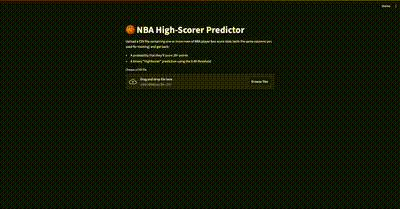

# 🏀 NBA High-Scorer Predictor

[](LICENSE) [](https://www.python.org/) [](https://github.com/VictoriaRBrito/nba-highscorer-predictor)

Predict whether an NBA player will drop **20+ points** in a game, end-to-end—from data cleaning to a live Streamlit demo! 🚀

---

## 📋 Table of Contents

- [🌟 Features](#-features)  
- [⚙️ Installation](#️-installation)  
- [🚀 Quick Start](#-quick-start)  
- [🛠️ Usage](#️-usage)  
  - [Notebook](#notebook)  
  - [Web App](#web-app)  
- [📹 Demo](#-demo)  
- [📂 Project Structure](#-project-structure)  
- [🔍 Modeling Pipeline](#-modeling-pipeline)  
- [🔢 Threshold & Prediction](#-threshold--prediction)  
- [🤝 Contributing](#-contributing)  
- [📄 License](#-license)  

---

## 🌟 Features

- 🎯 **High Accuracy:** F1-score > 0.93 for identifying 20+ point games  
- ⚖️ **Custom Thresholding:** Optimize precision vs. recall (default cutoff = 0.40)  
- 🖥️ **Interactive Demo:** Streamlit app for live CSV uploads & predictions  
- 🔄 **Reusable Module:** Clean `src/inference.py` for easy integration  
- 💾 **Serialization:** One-click model/feature/threshold loading  

---

## ⚙️ Installation

```bash
# 1. Clone
git clone https://github.com/VictoriaRBrito/nba-highscorer-predictor.git
cd nba-highscorer-predictor

# 2. Virtual env
python -m venv .venv
source .venv/bin/activate    # macOS/Linux
.venv\Scripts\activate       # Windows

# 3. Dependencies
pip install -r requirements.txt
```

---

## 🚀 Quick Start

1. **Place** your full dataset `nba_stats.csv` in `data/`  
2. **Run** the analysis notebook:
   ```bash
   jupyter notebook notebooks/analysis.ipynb
   ```
3. **Launch** the demo app:
   ```bash
   streamlit run app.py
   ```

---

## 🛠️ Usage

### Notebook

- Walk through data cleaning, EDA, model training & tuning.  
- Sections are clearly annotated for easy follow-along.  

### Web App

1. Upload a CSV (one or more rows of player stats).  
2. View predicted **Probability** and **HighScorer** label per row.  
3. 🎉 Share insights with coaches, analysts, or friends!

---

## 📹 Demo

Watch the Streamlit app in action:



---

## 📂 Project Structure

```
nba-highscorer-predictor/
├── assets/
│   └── demo.gif
├── data/
│   ├── nba_stats.csv
│   └── example_nba_stats.csv
├── notebooks/
│   └── analysis.ipynb
├── models/
│   ├── highscorer_model.pkl
│   ├── features_list.pkl
│   └── threshold.pkl
├── src/
│   └── inference.py
├── app.py
├── requirements.txt
├── .gitignore
└── README.md
```

---

## 🔍 Modeling Pipeline

1. **Data Cleaning & EDA**  
2. **Target Creation:** `HighScorer = 1 if PTS ≥ 20`  
3. **Feature Selection:** key stats (MP, FGA, FG%, 3PA, 3P%, FTA, FT%, TRB, AST, STL, BLK, TOV)  
4. **Train/Test Split:** stratified 80/20, `random_state=42`  
5. **Baseline Model:** Logistic Regression → evaluate metrics & ROC AUC  
6. **Refinement:** drop leaking features, hyperparameter tuning (CV), benchmark Random Forest  

---

## 🔢 Threshold & Prediction

- **Optimal Cutoff:** 0.40 (maximizes F1 = ~0.93)  
- **Inference:** call `predict_highscorer(df_new)` in `src/inference.py`  
- **Output:** binary labels + probability scores for each input row  

---

## 🤝 Contributing

Contributions are welcome!  
1. Fork the repo  
2. Create a feature branch  
3. Submit a pull request  

---

## 📄 License

Released under the **MIT License**.  
Feel free to use, adapt, or build on top of this work!

---

*Made with ❤️ by Victoria R Brito*
